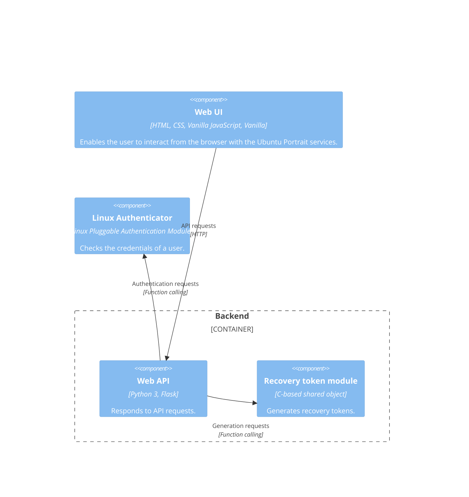

    

<h2 align="center">Vulnerable application for testing open source scanners</h2>

    

## Description

Ubuntu Portrait is a **vulnerable application** designed to be used for training purposes with open source tools or manual code review. All vulnerabilities are listed in [a section below](#known-vulnerabilities).

The application was created for the workshop "*The Open Source Fortress: Finding Vulnerabilities in Your Codebase Using Open Source Tools*," which debuted at [Ubuntu Summit 2023](https://events.canonical.com/event/31/contributions/219). Before that, it was tested in an internal CTF competition organised by the [Ubuntu Security Team](https://wiki.ubuntu.com/SecurityTeam).

Previous works, such as [Juice Shop](https://owasp.org/www-project-juice-shop), [WebGoat](https://github.com/WebGoat/WebGoat) and [WrongSecrets](https://owasp.org/www-project-juice-shop), inspired this project.

## Ubuntu Portrait

In a parallel universe where this program was intended to be provided to users, it would have been deployed on-premise, on each host that wanted to be accessible and (partially) managed via a web interface.

The following C4 diagram shows the application's general architecture:

## Setup

### Using GitHub Container Registry

1. Pull the image: `docker pull ghcr.io/iosifache/portrait:main`
2. Create a new container based on the image: `docker run --name portrait --env "PORTRAIT_RECOVERY_PASSPHRASE=<secret_key>" --publish 8080:8080 ghcr.io/iosifache/portrait`

### Building from source

1. Build the Docker image: `docker build --tag portrait .`
2. Create a new container based on the image: `docker run --name portrait --env "PORTRAIT_RECOVERY_PASSPHRASE=<secret_key>" --publish 8080:8080 portrait`

## Known vulnerabilities

### SHA256 hash length extension attack

- **CWEs**
  - CWE-1240: Use of a Cryptographic Primitive with a Risky Implementation
- **Affected component**: Recovery token module
- **Vulnerable code**: `generate_recovery_token()` in `portrait/c_modules/generate_recovery_token.c`
- **Attack vector**: Unauthenticated HTTP call to `/recovery_command`
- **Impact**: `root` account compromise and privilege escalation

### Command sandbox escape via `find`

- **CWEs**
  - CWE-78: Improper Neutralization of Special Elements used in an OS Command
- **Affected component**: Web API
- **Vulnerable code**: `is_an_allowed_command()` from `portrait/confinement.py`
- **Attack vector**: Authenticated HTTP call to `/command`
- **Impact**: Arbistrary command exectution as `$USER`

### Enabled Flask debugging

- **CWEs**
  - CWE-489: Active Debug Code
- **Affected component**: Web API
- **Vulnerable code**: `portrait/app.py`
- **Attack vector**: HTTP calls
- **Impact**: Information disclosure, and, eventually, code execution

### Heap out-of-bound write when generating recovery tokens

- **CWEs**
  - CWE 787: Out-of-bounds Write
- **Affected component**: Recovery token module
- **Vulnerable code**: `buf[]` from `generate_recovery_token()` in `portrait/c_modules/generate_recovery_token.c`
- **Attack vector**: Unauthenticated HTTP call to `/recovery_command`
- **Impact**: Memory write and, eventually, code execution

### Heap out-of-bound write when converting image formats with Pillow

- **CWEs**
  - CWE 787: Out-of-bounds Write
- **Affected component**: Web API
- **Vulnerable code**: `convert_format` in `portrait/image_ops.py`
- **Attack vector**: Unauthenticated HTTP call to `/convert_image`
- **Impact**: Memory write and, eventually, code execution

### Zip slipping when extracting user-submitted archives

- **CWEs**
  - CWE-23: Relative Path Traversal
- **Affected component**: Web API
- **Vulnerable code**: `extract_archive()` in `portrait/uploader.py`
- **Attack vector**: Authenticated HTTP call to `/upload`
- **Impact**: Arbitrary file write

### Arbitrary file write when extracting user-submitted archives

- **CWEs**
  - CWE-23: Relative Path Traversal
- **Affected component**: Web API
- **Vulnerable code**: `extract_archive_in_user_home()` in `portrait/uploader.py`
- **Attack vector**: Authenticated HTTP call to `/upload`
- **Impact**: Arbitrary file write

### IDOR when translating usernames to UIDs

- **CWEs**
  - CWE-641: Improper Restriction of Names for Files and Other Resources
  - CWE-280: Improper Handling of Insufficient Permissions or Privileges 
- **Affected component**: Web API
- **Vulnerable code**: `translate_username_to_uid()` in `portrait/app.py`
- **Attack vector**: Authenticated HTTP call to `/username`
- **Impact**: User enumeration

### Credentials and tokens logging

- **CWEs**
  - CWE-215: Insertion of Sensitive Information Into Debugging Code
- **Affected component**: Web API
- **Vulnerable code**: Multiple routes from `portrait/app.py`
- **Attack vector**: Access to the filesystem of the web server
- **Impact**: Accounts' compromise and, eventually, privilege escalation

### Insecure permissions for created logging file

- **CWEs**
  - CWE-279: Incorrect Execution-Assigned Permissions
- **Affected component**: Web API
- **Vulnerable code**: `check_log_file()` in `portrait/app.py`
- **Attack vector**: Access to the filesystem of the web server
- **Impact**: Accounts' compromise and, eventually, privilege escalation

### Default (and exposed) Flask secrets

- **CWEs**
  - CWE-318: Cleartext Storage of Sensitive Information in Executable
- **Affected component**: Web API
- **Vulnerable code**: `app.secret_key` from `portrait/app.py`
- **Attack vector**: Codebase access
- **Impact**: Exposure of the Flask secret used by all Portrait instances

### Default (and exposed) Flask secrets

- **CWEs**
  - CWE-318: Cleartext Storage of Sensitive Information in Executable
- **Affected component**: Web API
- **Vulnerable code**: `app.secret_key` from `portrait/app.py`
- **Attack vector**: Codebase access
- **Impact**: Exposure of the Flask secret used by all Portrait instances

### Lack of HTTPS

- **CWEs**
  - CWE-319: Cleartext Transmission of Sensitive Information
- **Affected component**: Web API, Web UI
- **Vulnerable code**: `app.secret_key` from `portrait/app.py`
- **Attack vector**: adversary-in-the-middle attack 
- **Impact**: Exposed credentials, commands, and other sensitive information transferred between the web UI and web API

## Acknowledgements

This project's logo was created with [Adobe Firefly](https://firefly.adobe.com).
