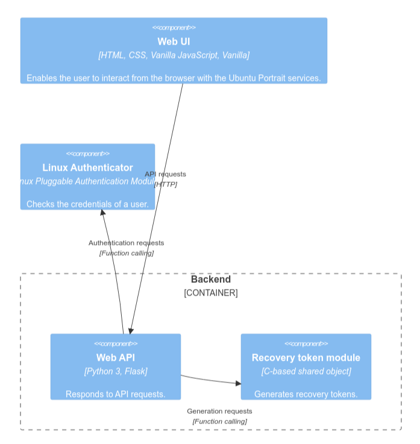
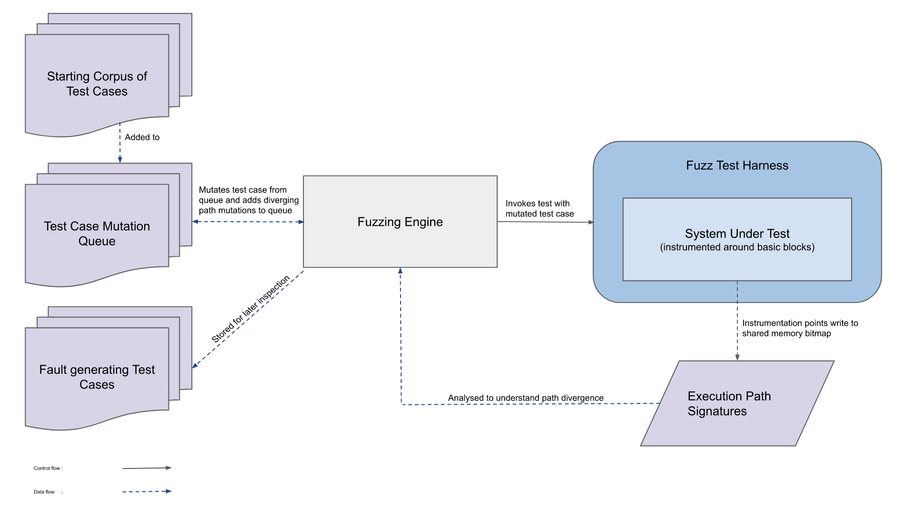

<style>
img[alt~="center"] {
  display: block;
  margin: 0 auto;
}

blockquote {
    font-size: 60%;
    margin-top: auto;
}
</style>

<!-- _class: lead -->

# The Open Source Fortress

---

# @iosifache

- Previous lives
  -  1.5 years in the Romanian Army
  -  Tech lead in [a cybersec startup](https://mutablesecurity.io/)
- Now software security engineer in [the Ubuntu Security Team](https://wiki.ubuntu.com/SecurityTeam)
- Bucharest-based
- Powered by Americanos
- Long-distance running as a hobby

---


---

## Roundcube Webmail

- Open source, browser-based IMAP client
- Hosted on [GitHub](https://github.com/roundcube/roundcubemail)
- With 5.2k stars (as per October 30, 2023)
- Written in XHTML, CSS, JavaScript (with jQuery), and PHP

---

## Q: What are we missing here?

1. `/installer/index.php` route stores the user-controlled configuration in <br/> `rcube->config`.
2. When an email with a non-standard format is received, `rcube::exec` executes the output of `getCommand`.

---

```php
private static function getCommand($opt_name)
{
    static $error = [];

    $cmd = rcube::get_instance()->config->get($opt_name);

    if (empty($cmd)) {
        return false;
    }

    if (preg_match('/^(convert|identify)(\.exe)?$/i', $cmd)) {
        return $cmd;
    }

    // Executable must exist, also disallow network shares on Windows
    if ($cmd[0] != "\\" && file_exists($cmd)) {
        return $cmd;
    }

    if (empty($error[$opt_name])) {
        rcube::raise_error("Invalid $opt_name: $cmd", true, false);
        $error[$opt_name] = true;
    }

    return false;
}
```

> From [`program/lib/Roundcube/rcube_image.php`](https://github.com/roundcube/roundcubemail/blob/ecaada40307f79f3e99c2e83a9de176f85525aeb/program/lib/Roundcube/rcube_image.php#L502)

---

## A: Input sanitisation

- [CVE-2020-12641](https://nvd.nist.gov/vuln/detail/CVE-2020-12641)
- Many vulnerable configuration items, leading to arbitrary code execution
- 7.66% EPSS and 9.8 CVSS
- [Used by APT28 to compromise Ukrainian organisations' servers](https://securityaffairs.com/147681/apt/apt28-hacked-roundcube-ukraine.html)
- Added by CISA in the [Known Exploited Vulnerabilities Catalogue](https://www.cisa.gov/known-exploited-vulnerabilities-catalog)

---

## But … Was it preventable?

- Yes, but not with standard linters or scanners
- Taint analysis as a possible solution
  - `rcube->config` as a tainted data source
  - `rcube::exec` as a sensitive sink

---

## The Open Source Fortress

- Lots of OSS tools that can be used to proactively detect vulnerabilities
- Structure
  - Factual information
    - General software and software security topics
    - Brief presentation of each analysis technique
  - Practical examples for analysing a vulnerable codebase
    - Infrastructure and access
    - Documentations
    - Proposed solutions

---


---


---


---

<style>
    div.twocols {
        margin-top: 35px;
        column-count: 2;
    }

    div.twocols p:first-child,
    div.twocols h1:first-child,
    div.twocols h2:first-child,
    div.twocols ul:first-child,
    div.twocols ul li:first-child,
    div.twocols ul li p:first-child {
        margin-top: 0 !important;
    }

    div.twocols p.break {
        break-before: column;
        margin-top: 0;
    }
</style>

<div class="twocols">

### YES,

- Large scale use in:
  - Profitable companies
  - Critical infrastructures
- Permissive licences
- Publicly reviewable code

<p class="break"></p>

### BUT

- Unpaid maintainers
- Unmaintained, vulnerable projects
- Lack of ethical security testing 
- Low-hanging fruits for threat actors

</div>

---

## Ubuntu Portrait

- [WebGoat](https://owasp.org/www-project-webgoat/)-like codebase
- "*lightweight piece of software that runs on an Ubuntu server and allows users to control it through their browsers*"
- On-premise deployment
- Written in Python and C
- 12+ embedded vulnerabilities

---



---


---

## Setup

- Only `docker compose up` for:
  - Pulling the images from Docker Hub or GHCR
  - Creating and running the containers

---

## Demo

---


---

## Threat modelling

- Identifying asset and threats
  - What we need to defend?
  - What can go wrong?
- Advantages
  - Secure by design
  - Prioritisation
  - Stakeholder confidence booster
  - Legal requirement (e.g., USA and Singapore)

---


> From [`AzureArchitecture/threat-model-templates`](https://github.com/AzureArchitecture/threat-model-templates)

---

## OWASP Threat Dragon

- Threat modelling tool backed by OWASP
- Usual process
  1. Threat model creation
  2. Diagram creation: STRIDE, CIA
  3. Asset representation: stores, process, actor, data flow, trust boundaries
  4. Manual threat identification, with type, status, score, priority, description, and mitigation


---

## Demo

---


---

## Secret scanning

- Searching for specific patterns or entropy for a secret (API key, credentials, tokens, etc.)
- Community (generic) rules

---

## Gitleaks

- Detector for hardcoded secrets 
- Analysis of the entire Git history
- Support for baselines and custom formats of secrets

---

## Demo

---


---

## Dependency scanning

- Iterating through all dependencies for finding their vulnerabilities
- Usage of the dependencies declaration list

---

## OSV-Scanner

- Client for [Google's OSV database](https://osv.dev), which embeds:
  - [GitHub Security Advisories](https://github.com/advisories)
  - [PyPA](https://github.com/pypa/advisory-database)
  - [RustSec](https://rustsec.org/advisories/)
  - [Global Security Database](https://github.com/cloudsecurityalliance/gsd-database)
- Support for ignored vulnerabilities

---


## Demo

---


---

## Linting

- Static analysis tool for finding issues before compiling/running the code
- Issues
  - Formatting
  - Grammar (for example, non-inclusive expressions)
  - Security

---

## Bandit

- Linter for Python
- Abstract syntax tree representation of the code
- Custom modules for:
  - Patterns of suspicious code
  - Deny lists of imports and function calls
  - Report generation
- Support for baselines

---

## flawfinder

- Linter for C
- Lexical scanning with detection of sensitive tokens

---

## Demo

---


---

## Code querying

- Searchin a specific pattern in the codebase
- Optional abstract representation of the codebase
   - Abstract syntax trees
   - Control flow graphs
- Query types
    - Lexical
    - Regex
    - Data structures specific to the abstract representation
- Community queries (but generic)

---


> From [Trail of Bit's "Fast and accurate syntax searching for C and C++"](https://blog.trailofbits.com/2022/12/22/syntax-searching-c-c-clang-ast/)

---

## Semgrep

- (Partially) open-source code scanner
- Support for 30+ programming languages
- No prior build requirements
- No DSL for rules
- Default or third-party rules

---

## Demo

---


---

## Fuzzing

- Running a program and offering random, unexpected inputs
- A crash = a security issue
- BFS traversal of the CFG
- Optimisation
  - Instrumenting the source code
  - Knowing the input format
  - Defining the states
  - Testing all input streams

---



> From [AdaCore's "Finding Vulnerabilities using Advanced Fuzz testing and AFLplusplus v3.0"](https://blog.adacore.com/advanced-fuzz-testing-with-aflplusplus-3-00)

---

## AFL++

- An [American Fuzzy Lop (AFL)](https://github.com/google/AFL) fork
- Additional features compared to AFL
  - QEMU emulation
  - Persistent mode
  - Optimisations
- Embedded in [Google's OSS-Fuzz](https://google.github.io/oss-fuzz/)

---

## Demo

---


---

## Symbolic execution

- Investigating all CFG paths by replacing the concrete values with symbolic ones
- Components
  - Sources
  - Sinks
  - Patterns
- Path explosion problem

---

<style>
    div.twocols {
        margin-top: 35px;
        column-count: 2;
    }

    div.twocols p:first-child,
    div.twocols h1:first-child,
    div.twocols h2:first-child,
    div.twocols ul:first-child,
    div.twocols ul li:first-child,
    div.twocols ul li p:first-child {
        margin-top: 0 !important;
    }

    div.twocols p.break {
        break-before: column;
        margin-top: 0;
    }
</style>

<div class="twocols">

```c
int f(int a, int b){
    int x = 1, y = 0;

    if (a != 0) {
        y = x + 3;
        if b == 0 {
            x = 2 * (a + b);
        }
    }

    return (a + b) / (x - y);
}
```

<p class="break"></p>


</div>

> From [symflower's "What is symbolic execution for software programs"](https://symflower.com/en/company/blog/2021/symbolic-execution/)

---

# KLEE

- Generic symbolic execution with security use cases
- Built on [LLVM](https://llvm.org/)

---

# Demo

---

## Other techniques

<!-- Keep this content syced with "wiki/docs/Other techniques.md" -->

- Stress/load testing
  - [JMeter](https://github.com/apache/jmeter) for many protocols and services
  - [`k6`](https://github.com/grafana/k6) for Kubernetes
- Web dynamic analysis
  - [OWASP's Zed Proxy Attack](https://github.com/zaproxy/zaproxy)

---


---

## Security tooling automation

<!-- Keep this content syced with "wiki/docs/Security tooling automation.md" -->

- [SARIF Multitool](https://github.com/microsoft/sarif-sdk/blob/main/docs/multitool-usage.md) for performing operations with SARIF files (merging, paging, querying, supressing, etc.)
- [Make](https://www.gnu.org/software/make/) and [Poe the Poet](https://github.com/nat-n/poethepoet) for running tasks
- IDE workflows (e.g., [VSCode tasks](https://code.visualstudio.com/Docs/editor/tasks)) for running the tooling while coding
- [`pre-commit`](https://github.com/pre-commit/pre-commit) for managing Git pre-commit hooks
- [`act`](https://github.com/nektos/act) or [GitLab Runner](https://docs.gitlab.com/runner/install/) for running CI/CD workflows locally
- [GitHub Actions](https://docs.github.com/en/actions) or [GitLab pipelines](https://docs.gitlab.com/ee/ci/) for running CI/CD workflows

---


---

## Security checklist I: Proactive vulnerability discovery

<!-- Keep this content syced with "wiki/docs/Security checklist.md" -->

☑️ Create a threat model.
☑️ Choose a suite of security tools to scan your codebase.
☑️ Automate the suite of security tools in local/development environments and CI/CD pipelines, with quality gates.
☑️ Request the integration of your project with OSS-Fuzz.
🔁 Periodically check for vulnerabilities in your dependencies.
🔁 Constantly validate the warnings from your security tooling.
🔁 Keep the threat model updated.

> One-time activities are marked with ☑️, and the recurrent ones with 🔁.

---

## Security checklist II: Secure users

<!-- Keep this content syced with "wiki/docs/Security checklist.md" -->

☑️ Design your software to be secure by default.
☑️ Have security recommendations for users.
☑️ Create SBOMs.

> One-time activities are marked with ☑️, and the recurrent ones with 🔁.

---

## Security checklist III: Established security reporting process

<!-- Keep this content syced with "wiki/docs/Security checklist.md" -->

☑️ Have a standardised, documented process for responding to vulnerabilities.
☑️ Create a security policy with preferred way to contact and report format.
☑️ Find backup security responders.
🔁 Be transparent and verbose with the reported vulnerabilities: mention patching commits, attach security tags to issues, and request CVE IDs.

> One-time activities are marked with ☑️, and the recurrent ones with 🔁.

---


---

## Recap I

- Roundcube Webmail vulnerability
- Open Source Fortress
- Software development model
- Software security model
- Open source software

---

## Recap II

- Techniques
  - Threat modelling
  - Secret scanning
  - Dependency scanning
  - Linting
  - Code querying
  - Symbolic execution
  - Fuzzing
- Automation
- Checklist

---


