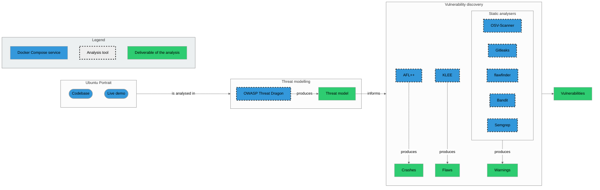

## Tooling

The tools that will be used during the workshop are:
- [OWASP Threat Dragon](/threat-modelling/owasp-threat-dragon) for modelling the cyberthreats for a given application;
- [Gitleaks](/secret-scanning/gitleaks) for scanning a Git repository for leaked secrets;
- [OSV-Scanner](/dependency-scanning/osv-scanner) for scanning dependencies for vulnerabilities;
- [flawfinder](/linting/flawfinder) for statically analysing C code to find security concerns;
- [Bandit](/linting/bandit) for lintinfor statically analysing Python code to find security concerns;
- [Semgrep](/code-query/semgrep) for code querying;
- [AFL++](/fuzzing/aflplusplus) for fuzzing C code; and
- [KLEE](/symbolic-execution) for symbolically executing C code.

## Docker infrastructure

For the analysed application and the above tooling, the workshop provides a Docker Compose infrastructure with the following services/containers:

### Ubuntu Portrait

- **Service name**: `portrait`
- **Description**: Demo Ubuntu Portrait instance
- **Docker Compose profiles**
    - `portrait`
    - `all`
- **`Dockerfile` in the `oss-fortress` repository**: `portrait/Dockerfile`
- **Hosted image**: `iosifache/oss_fortress_portrait:main` in GitHub Container Registry
- **Exposed ports**: `8000` for the web UI
- **User**: `root`
- **Credentials**: N/A
- **Relevant folders**: N/A

### OWASP Threat Dragon

- **Service name**: `owasp_threat_dragon`
- **Description**: OWASP Threat Dragon instance, accessible from [`localhost`](http://localhost:8081)
- **Docker Compose profiles**
    - `threat-modelling`
    - `all`
- **`Dockerfile` in the `oss-fortress` repository**: N/A
- **Hosted image**: `owasp/threat-dragon:latest` in Docker Hub
- **Exposed ports**: `8001` for the web UI
- **User**: `root`
- **Credentials**: N/A
- **Relevant folders**: N/A

### Coder

- **Service name**: `coder`
- **Description**: [Coder](https://coder.com) instance, accessible from [`localhost`](http://localhost:8082/?folder=/home/coder)
- **Docker Compose profiles**
    - `threat-modelling`
    - `all`
- **`Dockerfile` in the `oss-fortress` repository**: `tooling/images/coder/Dockerfile`
- **Hosted image**: `iosifache/oss_fortress_coder:main` in GitHub Container Registry
- **Exposed ports**: `8002` for the web UI
- **User**: `coder`
- **Credentials**: `oss-fortress` as the password for authenticating in the user interface
- **Relevant folders**
    - `/home/coder/codebase` for the Ubuntu Portrait codebase
    - `/home/coder/tooling` for the tooling-related information

### Static analysers

- **Service name**: `static-analysers`
- **Description**: Ubuntu container with static analysers (Gitleaks, OSV-Scanner, flawfinder, Bandit, and Semgrep) installed
- **Docker Compose profiles**
    - `static-analysis`
    - `all`
- **`Dockerfile` in the `oss-fortress` repository**: `tooling/images/static-analysers/Dockerfile`
- **Hosted image**: `iosifache/oss_fortress_static_analysers:main` in GitHub Container Registry
- **Exposed ports**: N/A
- **User**: `root`
- **Credentials**: N/A
- **Relevant folders**
    - `/home/coder/codebase` for the Ubuntu Portrait codebase
    - `/home/coder/tooling` for the tooling-related information

### AFL++

- **Service name**: `aflplusplus`
- **Description**: Container with AFL++ installed
- **Docker Compose profiles**
    - `dynamic-analysis`
    - `all`
- **`Dockerfile` in the `oss-fortress` repository**: N/A
- **Hosted image**: `aflplusplus/aflplusplus:latest` in GitHub Container Registry
- **Exposed ports**: N/A
- **User**: `root`
- **Credentials**: N/A
- **Relevant folders**
    - `/home/coder/codebase` for the Ubuntu Portrait codebase
    - `/home/coder/tooling` for the tooling-related information

### KLEE

- **Service name**: `klee`
- **Description**: Container with KLEE installed
- **Docker Compose profiles**
    - `dynamic-analysis`
    - `all`
- **`Dockerfile` in the `oss-fortress` repository**: N/A
- **Hosted image**: `klee/klee:latest` in GitHub Container Registry
- **Exposed ports**: N/A
- **User**: `root`
- **Credentials**: N/A
- **Relevant folders**
    - `/home/coder/codebase` for the Ubuntu Portrait codebase
    - `/home/coder/tooling` for the tooling-related information

## Overview

The below infrastructure presents the recommended workflow for analysis, using the recommended tooling and [Docker Compose services](#docker-infrastructure).

