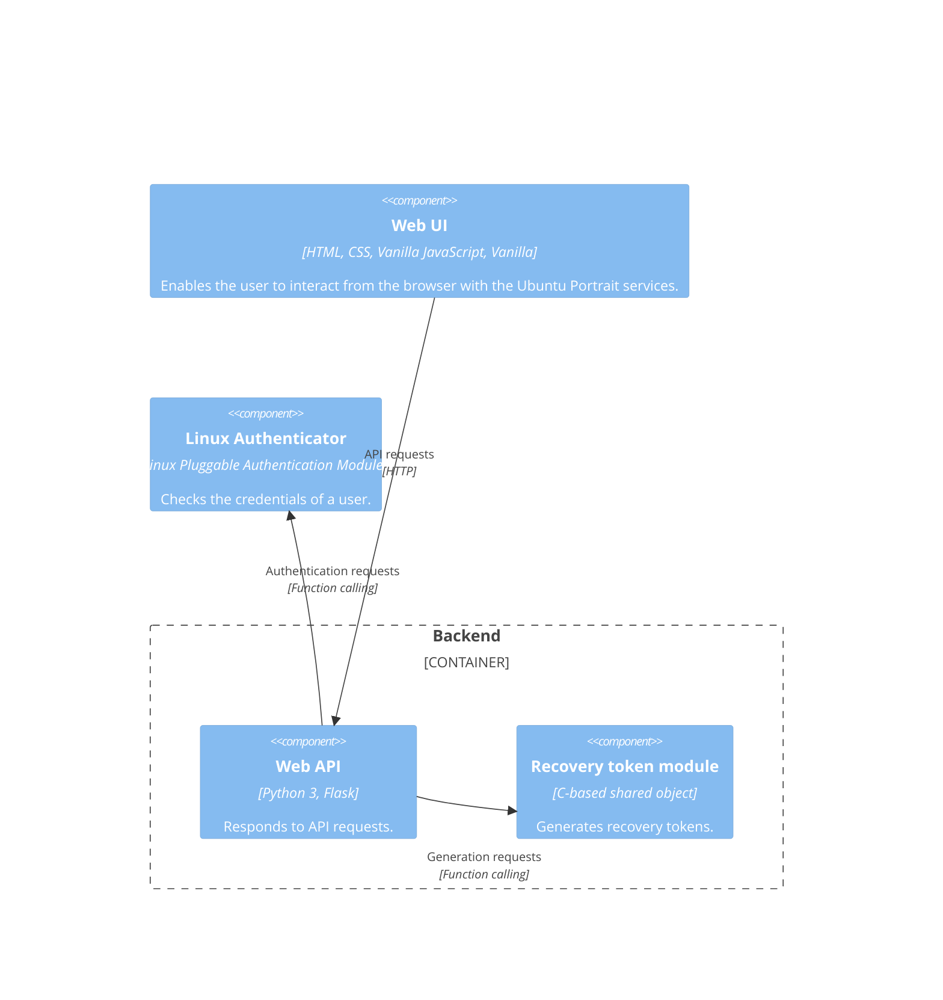

The following C4 diagram shows the application's general architecture:

```mermaid
C4Component
    Component(frontend, "Web UI", "HTML, CSS, Vanilla JavaScript, Vanilla", "Enables the user to interact from the browser with the Ubuntu Portrait services.")
    
    Container_Boundary(backend, "Backend") {
        Component(api, "Web API", "Python 3, Flask", "Responds to API requests.")
        Component(c_module, "Recovery token module", "C-based shared object", "Generates recovery tokens.")
    }

    Component(pam, "Linux Authenticator", "Linux Pluggable Authentication Modules", "Checks the credentials of a user.")

    Rel(frontend, api, "API requests", "HTTP")
    UpdateRelStyle(frontend, api, $offsetY="-60", $offsetX="-20")

    Rel(api, c_module, "Generation requests", "Function calling")
    UpdateRelStyle(api, c_module, $offsetY="50", $offsetX="-40")

    Rel(api, pam, "Authentication requests", "Function calling")
    UpdateRelStyle(api, pam, $offsetY="-50", $offsetX="-40")
```
